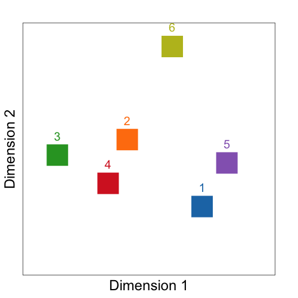

RConfMatrixPlot
===

RConfMatrixPlot is a framework in R for visualizing confusion matrices. The workflow is as follows, after loading the confusion matrix,

1. Convert the confusion matrix to a `dist` object.
2. Transform the `dist` object into a data representation for the visualization.
3. Visualize the data representation.

The files for each step are in the folders 'distance/', 'process/' and 'plot/'.

Here is an example for multidimensional scaling.

```
# Create example confusion matrix and labels
n = 6
confMatrix = matrix(abs(runif(n^2)), n, n) # square matrix with uniform distribution
confMatrix = sweep(confMatrix, 2, rowSums(confMatrix), `/`) # normalize rows

labels = list(names = 1:n,
              colors = c("#1f77b4", "#ff7f0e", "#2ca02c", "#d62728", "#9467bd", "#bcbd22"))


# 1. Get distance matrix from confusion matrix
dstMatrix = getDistances(confMatrix)
# 2. Get MDS representation
mdsRep = calculateMDS(dstMatrix)
# 3. Plot MDS
plotMDS(mdsRep, labels)

```

